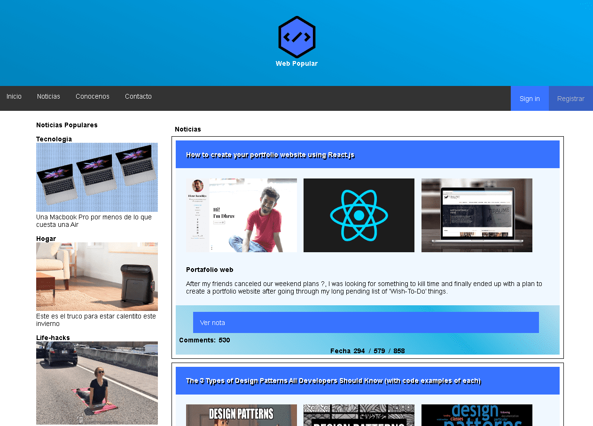
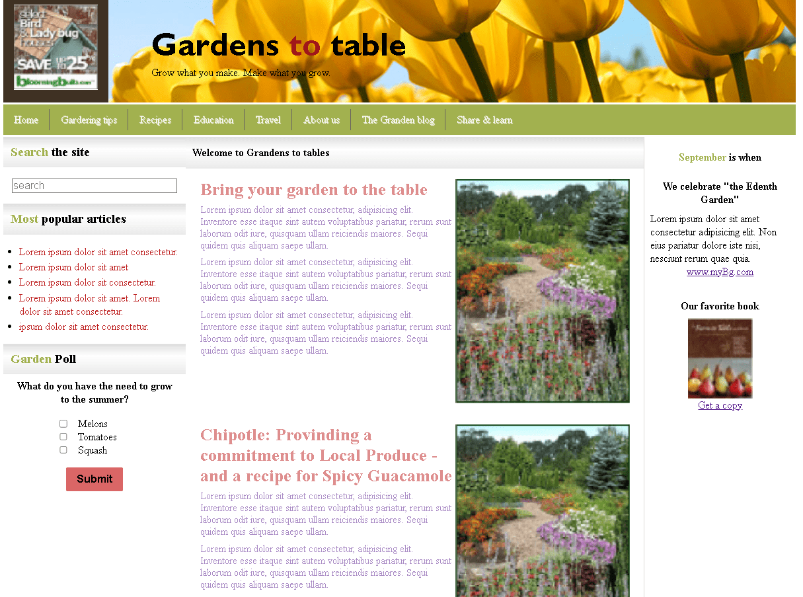
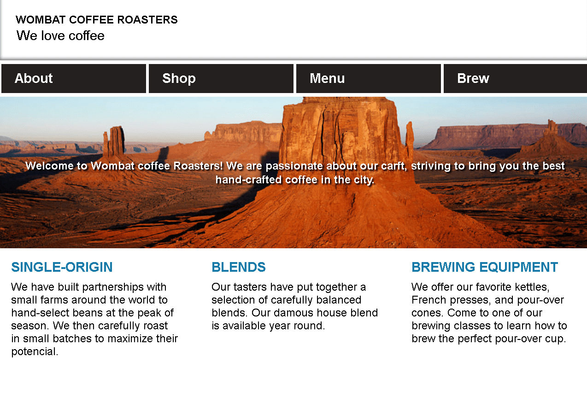

# Website Designs by Jonh Gomez

Here you will find a set or collection of pages where I have been practicing different aspects of a variaty of technologies, including HTML, CSS, JAVASCRIPT, SASS and UI together with UX.

## Development

You can use the entire code if you want. there is no problem.
Attention: You should know how to code in web development enviroment to generate a change.
next: all of the files are easy structurate so, there should not be any problems.

## Previews of the websites

|||||
|---|---|---|---|
|||||
